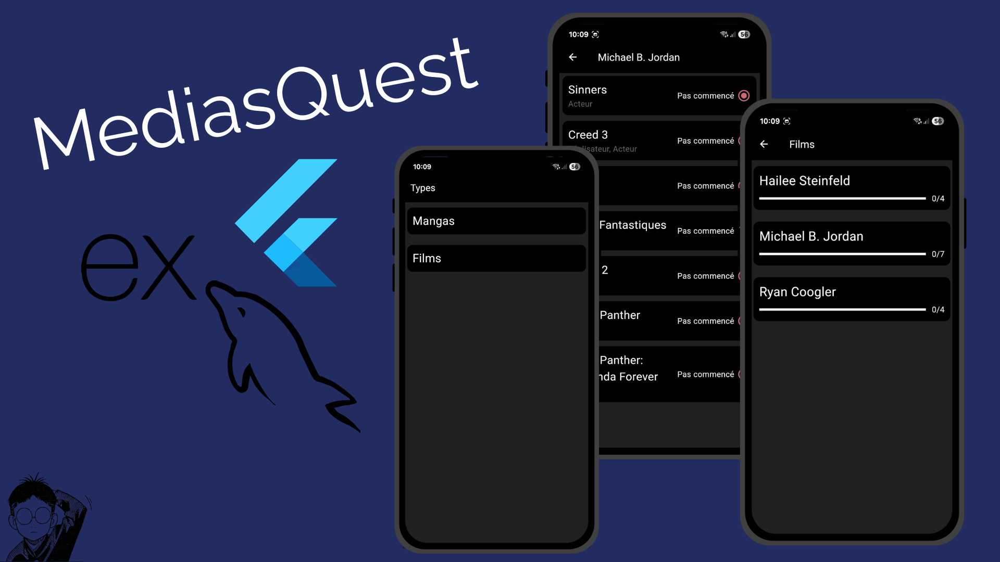

# MediasQuest

 

> Petite application mobile personnelle permettant de suivre différents types de médias (mangas, films, séries…). Chaque média est associé à un ou plusieurs artistes, et l’utilisateur peut gérer le statut de chaque média (vu, en cours, à regarder, etc.). L’application est structurée par catégories de médias et est utilisée uniquement par moi, non publiée sur les stores.

## Repos GitHub

Voici les différents repos liés à ce portfolio :  

- **Application Flutter** : [lien du repo](https://github.com/ASD-9/mediasQuest-mobile)  
- **Api** : [lien du repo](https://github.com/ASD-9/mediasQuest-api)  
- **Environnement (Docker Compose)** : [lien du repo](https://github.com/ASD-9/mediasQuest-env) 

## Technologies

- **Frontend** : Flutter  
- **Backend / API** : Express, MySQL  
- **Tests / Qualité** : Jest, SonarQube  
- **CI/CD / Conteneurisation** : GitHub Actions, Docker  
